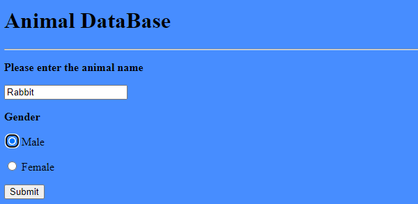
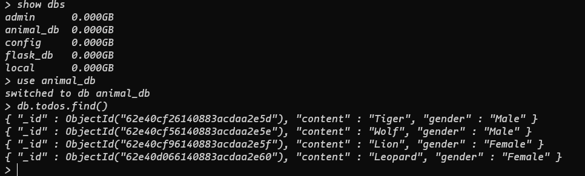

<p align="center">

# Ansible Full Stack App Deployment

  

</p>

## Summary

This project will feature provisioning `FullStack Application` first manually and than using [Ansible Playbooks](https://docs.ansible.com/ansible/latest/user_guide/playbooks_intro.html)

- Manual Installation `[PART 1]`
- Installation with Ansible Playbooks `[PART 2]`

Purpose of this repository is to demonstrate all the benefits that Ansible provides, once playbooks are created.

## Manual Deployment Process

### [MongoDB](https://www.mongodb.com/docs/) Installation and Setup

```
sudo cp /etc/ansible/mongodb.repo /etc/yum.repos.d/mongodb.repo
sudo yum install -y mongodb-org
```

Enable\Start MongoDB

```
sudo systemctl enable mongod
sudo systemctl start mongod
Check status of MongoDB
sudo systemctl status mongod
If there are any issues please check:
journalctl -xe
```

Creating Admin\Application user for MongoDB, instructions in `mongop2.sh`

### Backend Python/Flask

_App.py_ Code for inserting data into MonogoDB.

```
from flask import Flask, render_template, request, url_for, redirect
from pymongo import MongoClient
app = Flask(__name__)
client = MongoClient('192.168.6.1', 27017,
                     username='superadmin', password='password')
db = client.animal_db
todos = db.todos

@app.route('/', methods=('GET', 'POST'))
def index():
    if request.method == 'POST':
        content = request.form['content']
        gender = request.form['gender']
        todos.insert_one({'content': content, 'gender': gender})
        return redirect(url_for('index'))

    all_todos = todos.find()
    return render_template('index.html', todos=all_todos)


if __name__ == '__main__':
    app.run(debug=True)
```

Before running there are two required ENV Variables

```
$env:FLASK_APP = "app.py"
$env:FLASK_ENV = "development"
```

Run the APP

```
flask run
```

Flask will run website at `127.0.0.1:5000`, from here user can submit data to MongoDB via Post requests.



### Checking data in MongoDB

To login to MongoDB, type `mongo`, in this example `security Auth` is not included.

```
show dbs         #Shows all Collections
use use animal_db     #Switches to use animal_db collection
db.todos.find()  #It will show all POST Requests in Collection
```



## Systemd setup

`Work in Progress`

### Installing Go on `Centos7`

```
wget https://dl.google.com/go/go1.13.linux-amd64.tar.gz
tar -C /usr/local -xvzf go1.13.linux-amd64.tar.gz
```

After installation we need to setup PATH of [Go](https://computingforgeeks.com/install-go-golang-on-centos-rhel-linux/) installation Directory

```
sudo echo "export PATH=$PATH:/usr/local/go/bin" >> /home/vagrant/.bash_profile
source ~/.bash_profile
```

_To be continued...._
